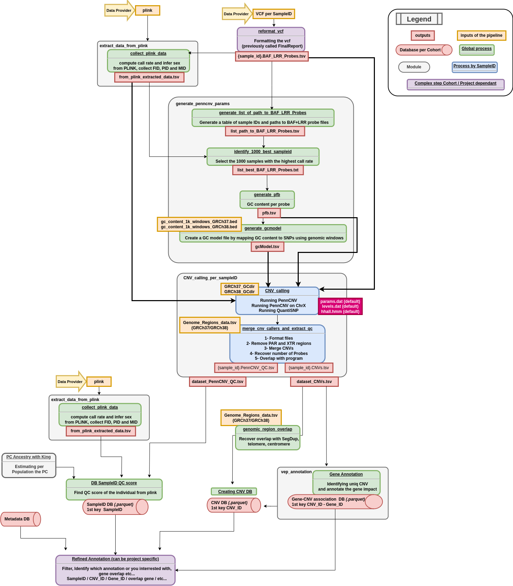

[Git Repository CNV-Calling-Microarray](https://github.com/JacquemontLab/CNV-Calling-Microarray)

# Documentation of the CNV Calling and Annotation Pipeline for Microarray
This repository contains a bioinformatics pipeline for the discovery and annotation of copy number variants (CNVs).
The workflow is implemented using Nextflow to ensure reproducibility and efficient execution.

## Pipeline Overview
This repository provides a Nextflow-based workflow for identifying and annotating CNVs on human the **GRCh37** or **GRCh38** human reference genome.

### Workflow DAG
Below is a graphical representation of the workflow:

### Prerequisite to run the pipeline:
- dataset_name : The name of the dataset used for directory and report names.
- list_sample_baflrrpath : A TSV file containing SampleID\tpath_to_BAF_LRR   The BAF LRR file name should be like : **{SampleID}.BAF_LRR.tsv**
- list_baflrr_path : A TXT file containing paths to BAF LRR file (basically *cut -f2* of the first). BAF LRR files should have the following format: Name\tChr\tPosition\t{SampleID}.Log R Ratio\t{SampleID}.B Allele Freq
- plink2samplemetadata_output : A TSV file containing SampleID\tCall_Rate\tSex\tFatherID\tMotherID (Father and Mother are only required if --report "true")
- genome_version is **GRCh37** or **GRCh38**
- batch_size :  The number of batch to process

Becarefull to the .hmm file used in process **callBatchCNVs**.

#### Other option have been implemented but not yet documented.
#### Need to describe from the one on AllOfUS, the protocol of merging.

## More Documentation
Here are some useful links about the plugins used in this pipeline, provided by VEP (Variant Effect Predictor).

### VEP

[Ensembl VEP Options](https://useast.ensembl.org/info/docs/tools/vep/script/vep_options.html)\
[Ensembl VEP Plugins](https://useast.ensembl.org/info/docs/tools/vep/script/vep_plugins.html)\
[Ensembl VEP Consequences](https://useast.ensembl.org/info/genome/variation/prediction/predicted_data.html)

We used the VEP docker: ensembl-vep : 113.0

## Current Limitations of the pipeline

- For PennCNV, default files such as **hhall.hmm** or **wgs.hmm** are used (available in the Docker docker://flobenhsj/quantisnp_penncnv:v2.1):
[Git PennCNV](https://github.com/WGLab/PennCNV)

- For QuantiSNP, default files such as **levels.dat** and **params.dat** are used (available in the Docker docker://flobenhsj/quantisnp_penncnv:v2.1):
[Git QuantiSNP](https://github.com/cwcyau/quantisnp)

- Resource requirements of each step must be adjusted depending on the quantity of data analyzed.

- Currently, only the Nextflow workflow has been written.
