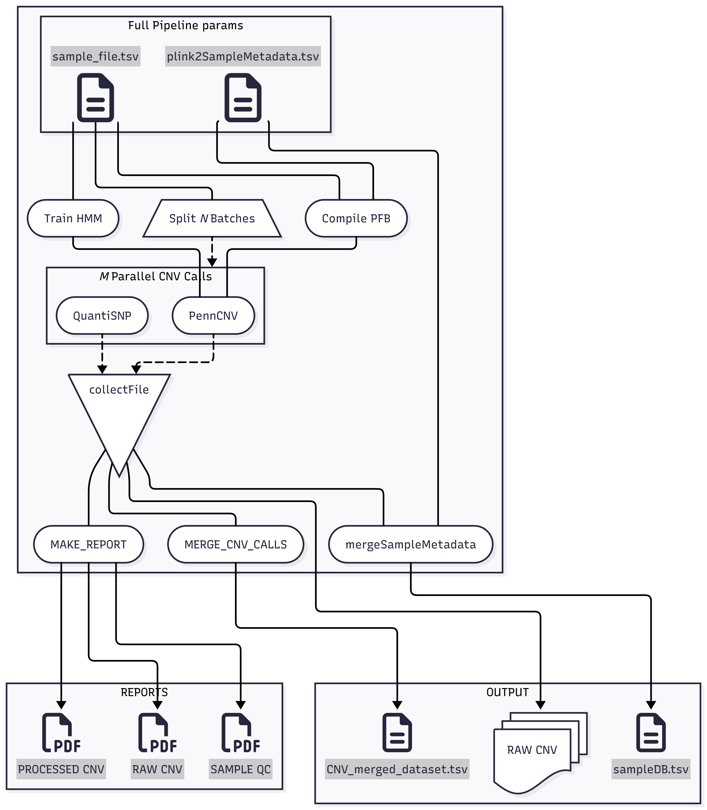

[](https://www.jacquemont-lab.org/)

[Git Repository CNV-Caller](https://github.com/JacquemontLab/CNV-Caller)

# CNV-Caller
#### A Nextflow pipeline for the discovery of copy number variants (CNVs) using Hidden Markov Model based CNV callers PennCNV and QuantiSNP. The pipeline utilizes B-Allele Frequency (BAF) and the Log-R Ratio (LRR) of probes on a standard genotyping array to call CNVs.


## Pipeline Modes

1. **Full Pipeline**

   * Runs **PennCNV** and **QuantiSNP** from raw BAF/LRR files.
   * Recommended when starting with raw genotype data and wanting end-to-end CNV detection.

2. **Partial Pipeline**

   * Starts from **PennCNV** and **QuantiSNP** outputs.
   * Skips raw CNV calling, useful if CNV files are already generated.

> Both modes share downstream processing steps such as CNV merging and reporting.


## Requirements

### Software dependencies

Refer to the template config files and adjust them to match your infrastructure.

Required software:

* **Nextflow** – workflow engine (nextflow version 25.10.2)
* **Docker** (Apptainer or Singularity) – to run containers

You might need to pull the following containers if working **offline**:
* docker://ghcr.io/jacquemontlab/cnv_caller_report:latest
* docker://ghcr.io/jacquemontlab/penncnv_quantisnp:v2.3
* docker://ghcr.io/jacquemontlab/python_etl_packages:latest


## Usage

### Testing

The pipeline can be tested using the test profile and the images hosted on github using the container of your choice. 

```bash
container=docker # or apptainer or singularity

# Full Mode
nextflow run https://github.com/JacquemontLab/CNV-Caller.git -profile test,test_full,${container}

# Partial Mode
nextflow run https://github.com/JacquemontLab/CNV-Caller.git -profile test,test_partial,${container}
```

### Example Launch

```bash
nextflow run main.nf \
    --dataset_name dataset \
    --genome_version "$genome_version" \
    --sample_file "$sample_file" \
    --plink2samplemetadata "$plink2samplemetadata" \
    --batch_size 10 \
    --report true \
    -c "$CONFIG_FILE"
```

## Inputs:

### Base Parameters
Parameters shared by both partial and full runs.

| Parameter | Description | Default | Required |
|-----------|-----------|-----------|-----------|
| `pipeline_mode` | Choose to run from raw BAF/LRR files or raw PennCNV and Quantisnp calls. (accepted: `full`\|`partial`) | full | Yes |
| `dataset_name` | Name of the dataset, used for directory and report naming. | dataset | No |
| `genome_version` | Human genome assembly version. (accepted: `GRCh38`\|`GRCh37`) | GRCh38 | No |
| `report` | Run summary statistics on all outputs. (accepted: `true`\|`false`) | false | No |

### Mode: Full

| Parameter | Description | Default | Required |
|-----------|-----------|-----------|-----------|
| `plink2samplemetadata` | Sample metadata derived from plink, see `Parameter Details`. <details><summary>Help</summary><small>A TSV file containing `SampleID  Call_Rate  Sex  FatherID  MotherID`. *FatherID* and *MotherID* are only required if `--report "true"` is used.</small></details>| | Yes |
| `sample_file` | A TSV file containing the Sample ID and the absolute path to the BAF_LRR file. See `Parameter Details` | | Yes |
| `pfb_max_sample_size` | Adjust the number of samples to use to generate the pfb file for PennCNV | 1000 | No |
| `data_type` | Specify if BAF/LRR values are from Array-based intensity values or Whole Genome Sequencing SNP ratios. (accepted: `array`\|`wgs`) | array | No |
| `batch_size` | Number of samples call CNVs in a single batch. | 64 | No |
| `batch_num` | Constrict the number of batches to execute. Useful for tuning batch sizes and node configurations without running the whole dataset. | -1 (all) | No |

### Mode: Partial

For users with PennCNV and Quantisnp raw calls. CNV-Caller will output merged CNVs with the minimal recommended filtering.

| Parameter | Description | Default | Required |
|-----------|-----------|-----------|-----------|
| `quantisnp_calls_path` |  Path to QuantiSNP raw CNVs file (.txt) | | Yes |
| `penncnv_calls_path` | Path to PennCNV raw CNVs file (.txt) | | Yes |
| `penncnv_qc_path` | QC metrics from PennCNV (SampleID → LRR\_SD, BAF\_SD, WF) | | required if `--report "true"` |
| `plink2samplemetadata` | Sample metadata derived from plink, see `Parameter Details`. <details><summary>Help</summary><small>A TSV file containing `SampleID  Call_Rate  Sex  FatherID  MotherID`. *FatherID* and *MotherID* are only required if `--report "true"` is used.</small></details>| | required if `--report "true"` |


### Parameter Details:

See the `tests/` directory for example input files.

  #### **plink2samplemetadata**: A TSV file (with header) containing:
  ```
  SampleID  Call_Rate  Sex  FatherID  MotherID
  ```
  > Sex should be "male", "female", or "unknown". Samples with "unknown" gender will only have autosomal CNVs identified; sex chromosome CNVs will not be analyzed.

  > *FatherID* and *MotherID* are only required if `--report "true"` is used, to assess Mendelian precision as an indicator of data quality.

  > Can be generated using [Git Repository Plink2SampleMetadata](https://github.com/JacquemontLab/Plink2SampleMetadata)
  
  #### **sample\_file**: A TSV file containing the Sample ID and the absolute path to the BAF_LRR file, eg:

  99HI0698C /home/example/path/99HI0698C.BAF_LRR.tsv
  99HI0700A /home/example/path/99HI0700A.BAF_LRR.tsv
  99HI0697A /home/example/path/99HI0697A.BAF_LRR.tsv

  > The filenames should follow the above format: **{SampleID}.BAF\_LRR.tsv**.

  #### The corresponding BAF_LRR files should be tab-delimited and formatted to follow PennCNV's required input format eg:

  ```
  Name	Chr	Position	{SampleID}.Log R Ratio  {SampleID}.B Allele Freq
  rs13072188	3	38411	-0.008173507	0.5777832
  rs9681213	3	41894	0.003111341	0.531952
  rs1516321	3	57010	-0.08156657	0.48049
  ```
  Where {SampleID} matches the filename. Eg: _99HI0698.Log R Ratio_.

  `Chr` should be formatted as `"1"`–`"22"`, `"X"`, or `"Y"`.


  **Recommendations for SNP positions:**

  * It is recommended to have only unique SNP positions (i.e., no more than one SNP per genomic coordinate).

  From personal communication with the authors of QuantiSNP (Ioannis Ragoussis and Rui Li):

  > "At the end of the day, the tool integrates signals from different positions, so we need only one per genomic coordinate. Sometimes multiple probes are designed for the same SNP just in case one probe may fail. It is okay to keep the better-performing probe (best call rate). Hope that helps."

  From the PennCNV author Wang Kai:

  > "You can keep just one SNP to avoid potential issues. One easy way is simply to modify the PFB file to remove duplicated SNPs."


## Outputs:

- **{dataset_name}**
  - **calls_unfiltered**
    - **penncnv**
      - `PennCNV_CNV.tsv` : Formatted PennCNV called CNV calls (filtered for length >1bp) in TSV.
      - `PennCNV_QC.tsv` : Quality control summary for PennCNV calls.
      - `PennCNV_raw_calls.txt` : Original CNV call output from PennCNV.
    - **quantisnp**
      - `QuantiSNP_CNV.tsv` : Formatted QuantiSNP called CNV calls (filtered for length >1bp) in TSV.
      - `QuantiSNP_raw_calls.txt` : Original CNV call output from QuantiSNP.
  - `CNV_merged_dataset.tsv` : **Final dataset with merged CNVs** See **Merging Protocol**.
  - **docs**
    - `launch_report.txt` : Summary of the analysis run.
    - `merged_cnv_qc.pdf` : QC report for the merged CNV dataset.
    - `penncnv_unfilter_cnv_qc.pdf` : QC report for unfiltered PennCNV calls.
    - `quantisnp_unfilter_cnv_qc.pdf` : QC report for unfiltered QuantiSNP calls.
    - `sample_qc_report.pdf` : Sample-level QC metric report.
  - `sampleDB.tsv` : **Sample database** containing metadata and QC status for all genotyped individuals.


The `CNV_merged_dataset.tsv` fields are as follows:

| **Column**      | **Description**                                                 |
| --------------- | --------------------------------------------------------------- |
| **SampleID**                    | Unique identifier of the sample.            |
| **Chr**                         | Chromosome where the CNV is located.            |
| **Start**                       | Start position of the CNV.            |
| **End**                         | End position of the CNV.            |
| **Type**                        | Type of CNV: `DEL` = deletion, `DUP` = duplication, `MIX` = mixed type (event includes both deletions and duplications, inferred from Copy\_Number states). |
| **Length**                      | Length of the CNV in base pairs.            |
| **Copy\_Number**                | Distinct copy number states observed among merged CNVs (e.g., 0, 1, 3, 4). Multiple values are separated by commas if differing between callers. |
| **Confidence\_max**             | Maximum confidence score among merged CNVs (reflecting the strongest supporting evidence).            |
| **Num\_Probes\_max**            | Maximum number of probes supporting the CNV across merged CNVs.            |
| **Num\_Merged\_CNVs**           | Number of CNVs merged into this event.            |
| **QuantiSNP\_Overlap**          | Fraction of the CNV region overlapping QuantiSNP calls.            |
| **PennCNV\_Overlap**            | Fraction of the CNV region overlapping PennCNV calls.            |
| **Two\_Algorithm\_Overlap**     | Fraction of the CNV region supported by both QuantiSNP and PennCNV.            |
| **ProblematicRegions\_Overlap** | Overlap with problematic regions (Segmental Duplications, Major Histocompatibility Complex, Centromeres, Telomeres, and UCSC Problematic Regions), compiled from the UCSC Genome Browser (hgTables), for more details see section `Problematic Regions`.|


The `sampleDB.tsv` fields are as follows:

| **Column**      | **Description**                                                 |
| --------------- | --------------------------------------------------------------- |
| **SampleID**   | Unique sample identifier from the PLINK dataset.                 |
| **LRR\_mean**   | Mean Log R Ratio (from PennCNV output).                         |
| **LRR\_median** | Median Log R Ratio (from PennCNV output).                       |
| **LRR\_SD**     | Standard deviation of Log R Ratio (from PennCNV output).        |
| **BAF\_mean**   | Mean B Allele Frequency (from PennCNV output).                  |
| **BAF\_median** | Median B Allele Frequency (from PennCNV output).                |
| **BAF\_SD**     | Standard deviation of B Allele Frequency (from PennCNV output). |
| **BAF\_DRIFT**  | B Allele Frequency drift metric (from PennCNV output).          |
| **WF**          | Waviness Factor (from PennCNV output).                          |
| **GCWF**        | GC-corrected Waviness Factor (from PennCNV output).             |
|*__COLUMNS OF `plink2samplemetadata`__*|  


## Methodological Notes

### Paragraph method, by Florian Bénitière, 04/08/2025 : **CNV Merging process**

Copy Number Variants (CNVs) were called using two programs: PennCNV ([Wang et al., 2007](http://www.genome.org/cgi/doi/10.1101/gr.6861907)) and QuantiSNP ([Colella et al., 2007](https://doi.org/10.1093/nar/gkm076)).

A pre-filtering step was applied to each CNV call set independently to exclude low-confidence variants prior to merging. Specifically, CNVs with confidence scores below 30 in PennCNV and below 15 in QuantiSNP were removed (based on results from the SPARK cohort; see SPARK_PennCNV_calls.pdf and SPARK_QuantiSNP_calls.pdf). We also required CNVs to be longer than 1 kilobase, a commonly accepted threshold for CNVs ([Eichler, 2008](https://www.nature.com/scitable/topicpage/copy-number-variation-and-human-disease-698/)). In addition, CNVs overlapping the pseudoautosomal regions (PARs or XTR) of the X chromosome with a copy number of 2 were excluded, as these regions normally contain two copies in males (one on chrX and one on chrY) and therefore do not represent true CNVs.

CNVs from both tools were then merged to generate a unified CNV set. For each CNV, we calculated the fraction of support across the two algorithms (**Two\_Algorithm\_Overlap**). The CNV **Type** was inferred based on the copy number values within each unified CNV region: regions with all values \≥2 were labeled duplications ("DUP"), all values <2 as deletions ("DEL"), and regions with mixed values as mixed ("MIX").

We next assessed the overlap of each CNV with **problematic regions**. These regions were compiled from the UCSC Genome Browser ([hgTables](https://genome.ucsc.edu/cgi-bin/hgTables)) and include segmental duplications, the major histocompatibility complex, centromeres, telomeres, and the UCSC Problematic Regions tracks.


### Filtering Recommendations
#### CNVs
For downstream analyses, we recommend filtering the final CNV set using the following criteria (based on results from the SPARK cohort; see `resources/docs/SPARK_CNV_dataset_report.pdf`):

* **Two\_Algorithm\_Overlap \≥ 0.5** (validated by at least 50% overlap between both algorithms)
* **ProblematicRegions\_Overlap < 0.5** (less than 50% overlap with problematic regions)
* **Type == DEL or DUP** (only CNVs with an unambiguous type)

The **Confidence\_max** can also be used as the **Copy\_Number**, but based on our results we do not recommend adding this complexity to the method.

### Individuals
According to Liu, J., Zhang, L., Xu, L. *et al.*
*Analysis of copy number variations in the sheep genome using 50K SNP BeadChip array.*
**BMC Genomics** 14, 229 (2013). [https://doi.org/10.1186/1471-2164-14-229](https://doi.org/10.1186/1471-2164-14-229)

The quality filters used were:

* **LRR standard deviation (SD) < 0.30**
* **BAF drift < 0.01**
* **Waviness factor between −0.05 and 0.05**

In addition, based on common practice in CNV detection studies (e.g., PennCNV and Illumina genotyping guidelines), we recommend applying a filter on the call rate, although the threshold may be adjusted depending on the cohort:

* **Call Rate \≥ 0.98**

### Previous implementation
Our lab used previous versions of the CNV calling described in the following references:
* Effects of gene dosage on cognitive ability: A function-based association study across brain and non-brain processes. Huguet et al, 2024, Cell Genomics [https://doi.org/10.1016/j.xgen.2024.100721](https://doi.org/10.1016/j.xgen.2024.100721)
* Measuring and Estimating the Effect Sizes of Copy Number Variants on General Intelligence in Community-Based Samples. Huguet et al, 2021, Molecular Psychiatry [https://doi.org/10.1038/s41380-020-00985-z](https://doi.org/10.1038/s41380-020-00985-z)
* Measuring and Estimating the Effect Sizes of Copy Number Variants on General Intelligence in Community-Based Samples. Huguet et al, 2018, JAMA Psychiatry [https://doi.org/10.1001/jamapsychiatry.2018.0039](https://doi.org/10.1001/jamapsychiatry.2018.0039)

Theses articles used the method described in this previous repository:
[https://github.com/JacquemontLab/MIND-GENESPARALLELCNV](https://github.com/JacquemontLab/MIND-GENESPARALLELCNV)

#### Problematic Regions

This region regroups multiple tables from UCSC Genome Browser ([hgTables](https://genome.ucsc.edu/cgi-bin/hgTables)): Segmental Duplications, Major Histocompatibility Complex, Centromeres, Telomeres, and Problematic Regions from UCSC.
For details, please refer to the file CNV-Caller/resources/Genome_Regions/README.md 


### Softwares Used

Within the pipeline, the GC model, the HMM profile and PFB files required by PennCNV are prepared. 
CNVs are then called per individual on autosomes and chromosome X (only if the sample’s sex is known) using the container `docker://ghcr.io/jacquemontlab/penncnv_quantisnp:v2.3` and the following tools:

#### PennCNV

PennCNV ([Wang *et al.*, 2007](http://www.genome.org/cgi/doi/10.1101/gr.6861907))

PennCNV is run separately on autosomes and on chromosome X using the commands below.

* Default parameters available in the Docker image:

  * `hmm_file="/usr/local/PennCNV-1.0.5/lib/wgs.hmm"`
  * `hmm_file="/usr/local/PennCNV-1.0.5/lib/hhall.hmm"`
  * `hmm_file="/usr/local/PennCNV-1.0.5/lib/hh550.hmm"`

```bash
# Autosomes
perl detect_cnv.pl --test \
    --conf \
    --pfbfile ${pfb_file} \
    --hmmfile ${hmm_file} \
    --logfile ${sample_id}.penncnv.log \
    --output ${sample_id}.penncnv.out \
    --gcmodelfile ${gcmodel_file} \
    ${BAF_LRR_Probes}

# Chromosome X
perl detect_cnv.pl --test \
    --conf \
    --pfbfile ${pfb_file} \
    --hmmfile ${hmm_file} \
    --logfile ${sample_id}.penncnv.chrx.log \
    --output ${sample_id}.penncnv.chrx.out \
    --gcmodelfile ${gcmodel_file} \
    --sexfile sexfile.tsv \
    --chrx \
    ${BAF_LRR_Probes}
```

 The `.hmm` file used by PennCNV in the **generate_hmm** process should match your data type. Pre-existing HMMs differ in probe density and signal characteristics. This can be modified using `data_type` parameter:

| HMM File    | Intended Data Type                | Notes                                                    |`data_type`|
| ----------- | --------------------------------- | -------------------------------------------------------- |-----------|
| `hhall.hmm` | High-density SNP arrays (general) | Captures broad allele patterns across multiple platforms |`array`    | 
| `hh550.hmm` | Illumina HumanHap550 arrays       | Optimized for 550k probe density and distribution        |           | 
| `wgs.hmm`   | Whole-genome sequencing           | High-resolution data; dense and uniform coverage         |`wgs`      |

#### QuantiSNP

QuantiSNP ([Colella *et al.*, 2007](https://doi.org/10.1093/nar/gkm076))

QuantiSNP is executed using default configuration files (`levels.dat`, `params.dat`) and GC content files provided for each chromosome.
Sex is inferred beforehand, and the appropriate `--gender` flag is passed to ensure proper calling on sex chromosomes.

* Default parameters available in the Docker image:

  * `chr="1:23"`
  * `gcdir=/usr/local/QuantiSNP-2.3/GC_correction/${genome_version}/GCdir/`
  * `levels="/usr/local/QuantiSNP-2.3/bin/config/levels.dat"`
  * `config="/usr/local/QuantiSNP-2.3/bin/config/params.dat"`

```bash
quantisnp --chr ${chr} \
    --outdir . \
    --sampleid ${sample_id} \
    --gender ${gender} \
    --config ${config} \
    --levels ${levels} \
    --gcdir ${gcdir} \
    --input-files ${BAF_LRR_Probes} \
    --doXcorrect --verbose
```

### Current Limitations of the pipeline

- For PennCNV, default files such as **hhall.hmm** or **wgs.hmm** are used (available in the Docker docker://flobenhsj/quantisnp_penncnv:v2.3):
[Git PennCNV](https://github.com/WGLab/PennCNV)

- For QuantiSNP, default files such as **levels.dat** and **params.dat** are used (available in the Docker docker://flobenhsj/quantisnp_penncnv:v2.3):
[Git QuantiSNP](https://github.com/cwcyau/quantisnp)


## Pipeline Execution and Technical Implementation

 CNV-Caller uses batch processing to call CNVs in parallel. When configured on an HPC cluster, the samples can be batched in to groups of size _N_ where each sample is assigned a CPU on a compute node. Batches can also be run in parallel across _M_ nodes such that the total number of parallel processes would then be _M_ x _N_ . See **Configuration** on how to tune process batching.

<picture>
  <source media="(prefers-color-scheme: dark)" srcset="img/CNV-Caller_dag_dark_full.png">
  <source media="(prefers-color-scheme: light)" srcset="img/CNV-Caller_dag_light_full.png">
  
</picture>


Or use a parameter yaml file to specify parameters
 eg:

*__params.yaml__*
```yaml
dataset_name: My_Cohort
genome_version: GRCh38
plink2samplemetadata: /home/path_to/plink2samplemetadata.tsv
sample_file: /home/path_to/sample_file.tsv
batch_size: 180
pfb_sample_size : 1000
report : false
pipeline_mode : full
data_type : 'array'

## Configuration 
Configuration of the pipeline is necessary to match the needs of your cluster and dataset. What's provided below is a template for launching on an HPC using SLURM job managment with access to the internet for container retrieval. 

In this configuration the lead process is launched on local and the larger jobs are automatically queued on compute nodes.

The two major processes are `cnv_calling` and `generate_pfb` which may require a lot of resources. In our example `180` samples are loaded in to a compute node with 192 cpus and 750G of memory for calling cnvs. Using `maxForks` we'll ask for 10 nodes to be allocated at once. Using this configuration will allow for `1800` samples to be processed at once. 

*__example.config__*
```nextflow

executor.queueSize = 11
process {
    executor = 'local'
    module = ['apptainer/1.3.5']
 
    withLabel: cnv_calling {
        executor = 'slurm'
        time = { 3.hour * task.attempt }
        memory = '750G'
        cpus = 192
        module = ['apptainer/1.3.5']
        maxRetries = { task.exitStatus == 140 ? 4 : 1 }
        maxForks = 10
        errorStrategy = { task.exitStatus == 140 ? 'retry' : 'terminate' }
        }

    withName: generate_pfb {
        executor = 'slurm'
        module = ['apptainer/1.3.5']
        time = { 1.hour * task.attempt }
        cpus = 192
        memory = '750G'
        maxRetries = { task.exitStatus == 140 ? 4 : 1 }
        errorStrategy = { task.exitStatus == 140 ? 'retry' : 'terminate' }
        }

    withLabel: Rmarkdown {
        executor = 'slurm'
        cpus = 32
        memory = '112G'
        module = ['apptainer/1.3.5']
    }
}

```
If compute nodes lack internet access, the containers can be cached elsewhere and absolute paths can be used for the required processes. The default config is as follows:

*__nextflow.config__*
```nextflow
profiles {

    apptainer {
        apptainer.enabled = true
        process  {
            container = 'docker://ghcr.io/jacquemontlab/python_etl_packages:latest'
        
            withLabel: penncnv_quantisnp {
                container = 'docker://ghcr.io/jacquemontlab/penncnv_quantisnp:v2.3'

            }

            withLabel: Rmarkdown {
                container = 'docker://ghcr.io/jacquemontlab/cnv_caller_report:latest'

            }
        }
    }
}
```
Nextflow allows for deep configuration which makes pipelines portable to both cloud, HPC and local execution. See [https://www.nextflow.io/docs/latest/config.html](https://www.nextflow.io/docs/latest/config.html) for more details.


To launch make sure to include custom configurations using the -c parameter.

```
nextflow run https://github.com/JacquemontLab/CNV-Caller -profile apptainer -c example.config -params_file params.yaml 
```

Or if downloaded:

```
nextflow run main.nf -profile apptainer -c example.config -params_file params.yaml
```

